<p align="center">
  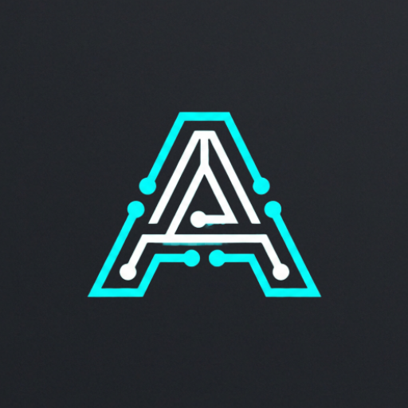
</p>

<h1 align="center">🛰️ ANTAR</h1>

<h3 align="center">Know your device inside out — every chip, every sensor, every signal.</h3>

<p align="center">
  
</p>

<p align="center">
  <a href="https://developer.android.com"></a>
  <a href="https://kotlinlang.org"></a>
  <a href="https://developer.android.com/jetpack/compose"></a>
  
  
</p>

---

## 🤔 Why This Project Exists

> **Can one app replace five different "device info" apps on the Play Store?** → That's the question that started ANTAR.

I kept installing separate apps to check my battery health, sensor list, network details, and CPU frequency — each one bloated with ads and missing something the other had. So I built ANTAR as a single, clean, ad-free tool that surfaces **everything** about your Android device in one place.

This is an active, real-world project. It has real bugs, real limitations, and I'm iterating on it constantly. Claude Code was used as a development tool during parts of this project — for code reviews, refactoring suggestions, and documentation — but every architectural decision, UI design, and feature was built and tested by hand on physical devices.

> **Who is this for?** → Developers debugging hardware issues, power users who want to know their device deeply, and anyone who's ever wondered "what sensors does my phone actually have?"

---

## 📱 What is ANTAR?

ANTAR is an Android app that reads every piece of hardware and software information your device exposes — CPU, battery, sensors, GPS satellites, network, display, storage, camera — and presents it in a beautiful dark-themed dashboard with real-time updates.

```
📱 Your Device → 🔧 Android System APIs → 📊 Real-time Dashboard → 💡 Actionable Insights
     (Hardware)     (Sensors, Managers,       (Compose Canvas        (Health scores,
                     Telephony, Location)       Charts & Gauges)       metrics, alerts)
```

---

## 📸 Screenshots

| Dashboard | Device | System | CPU |
|:---------:|:------:|:------:|:---:|
| 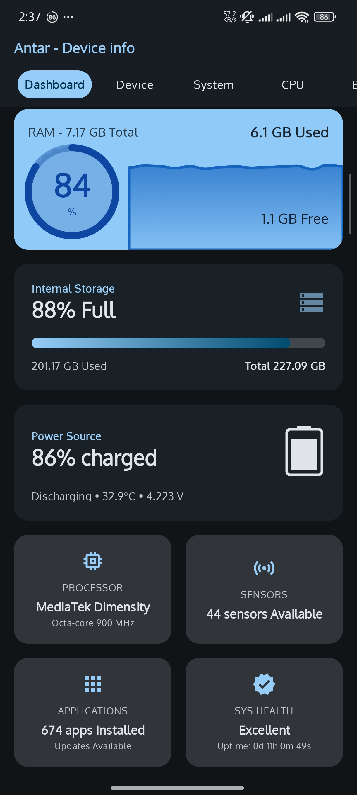 | 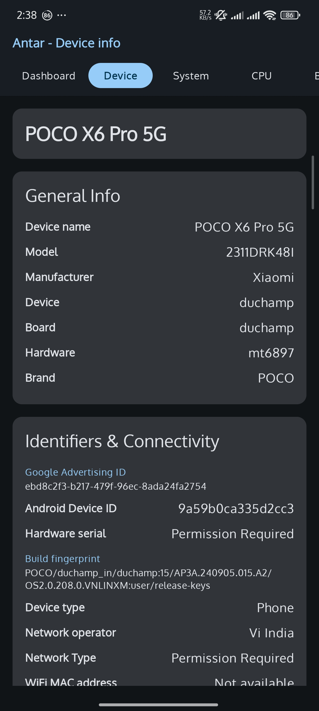 | 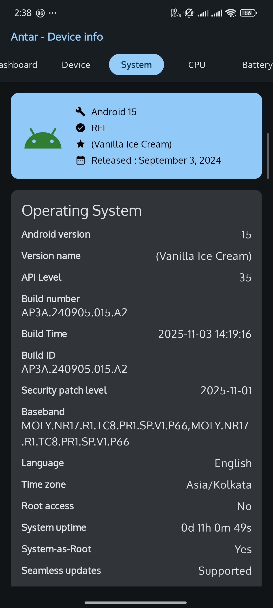 | 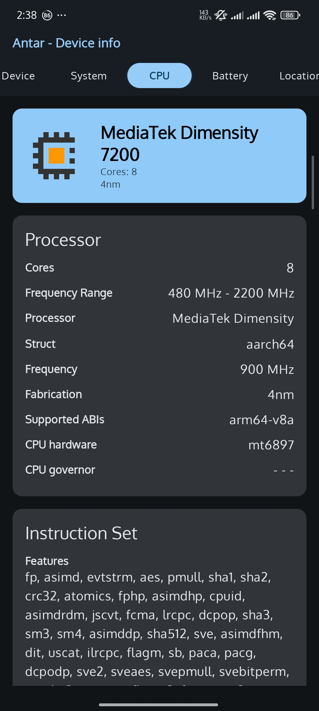 |

| Battery | Battery Health | Location | Network |
|:-------:|:--------------:|:--------:|:-------:|
| 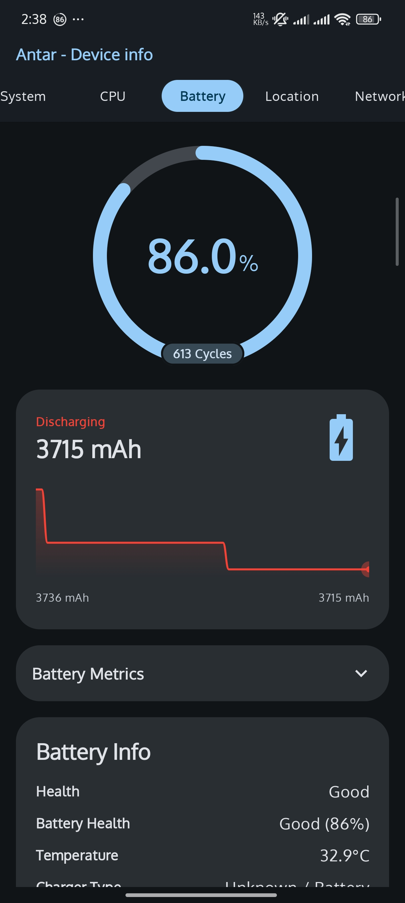 | 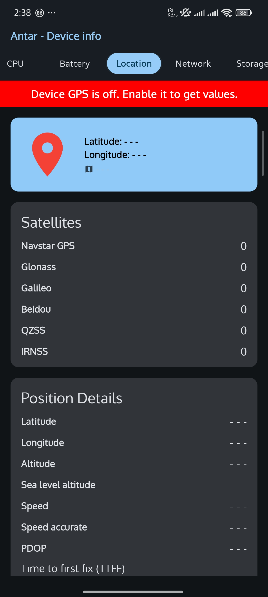 | 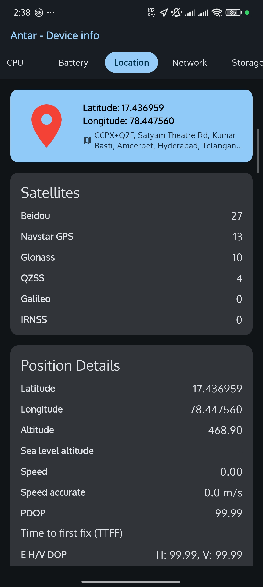 | 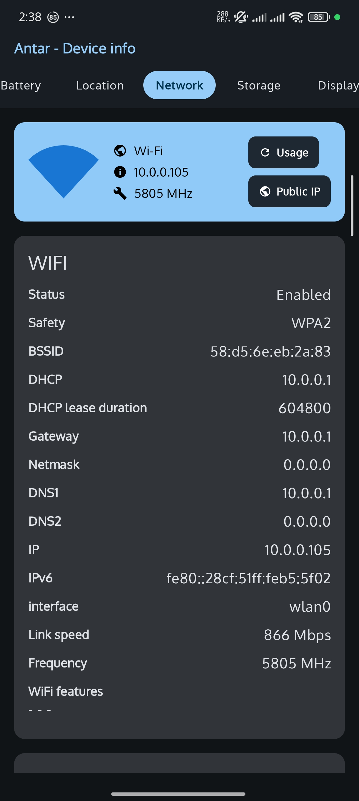 |

| Storage | Display | Sensors | Apps |
|:-------:|:-------:|:-------:|:----:|
|  | 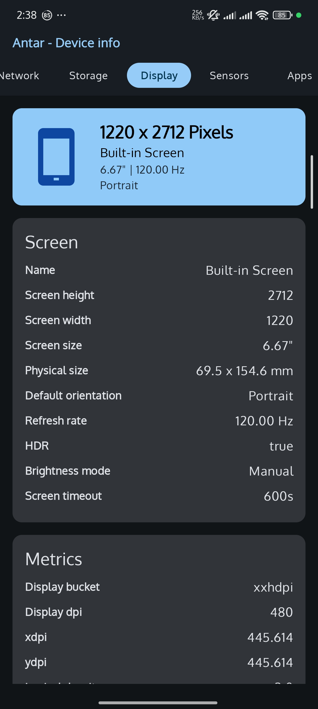 | 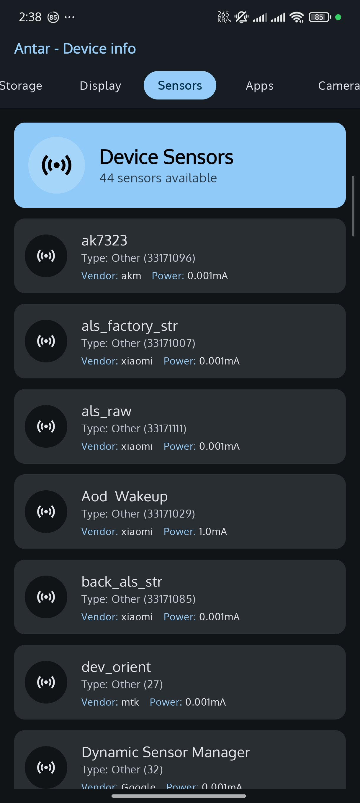 | 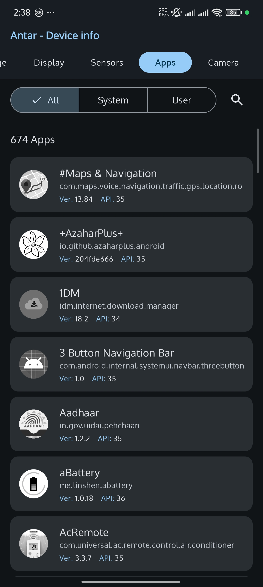 |

| CAMERA Info |
|:--------:|
| 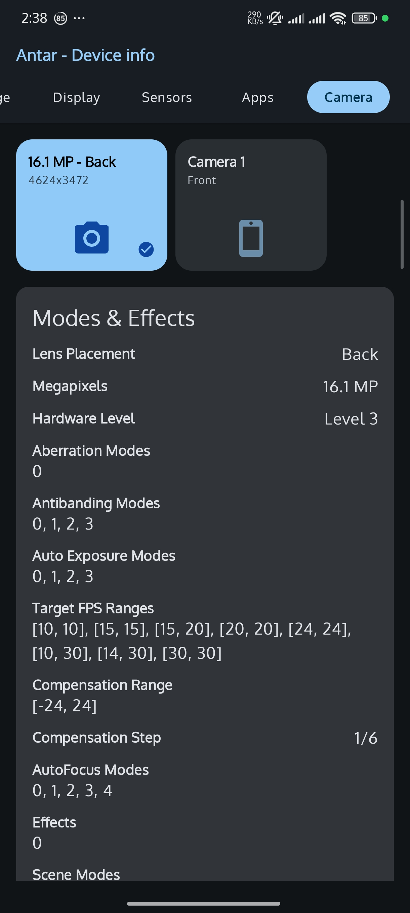 |

---

## 🎯 Features

### 📊 Dashboard  

| Feature | What it does |
|---------|-------------|
| 🧠 RAM Monitor | Real-time memory usage with animated circular progress |
| 💾 Storage Overview | Internal storage breakdown with visual progress bar |
| 🔋 Power Source | Battery %, charging state, temperature, voltage |
| ⚡ Processor Info | Chipset name, core count, clock speed at a glance |
| 📡 Sensor Count | Total available hardware sensors on your device |
| 📦 App Count | Installed apps with update detection |
| 💚 System Health | Overall device health score with uptime tracking |

### 📱 Device Information 

| Feature | What it does |
|---------|-------------|
| 🏭 Hardware Details | Model, manufacturer, brand, board, bootloader |
| 🔑 Build Fingerprint | Full build fingerprint, product name, hardware ID |

### ⚙️ System 

| Feature | What it does |
|---------|-------------|
| 🤖 Android Info | Version, API level, build number, security patch |
| 📻 Baseband & Kernel | Radio version, kernel info, build details |
| 🔓 Root Detection | Checks for root access, System-as-Root, Seamless Updates |

### 🔧 CPU 

| Feature | What it does |
|---------|-------------|
| 🏗️ Architecture | ARM, x86, or ARM64 detection |
| ⏱️ Clock Speeds | Min/max/current frequency per core |
| 📈 Real-time Monitor | Live per-core frequency updates |
| 🎛️ Governor Info | CPU governor and scaling driver details |

### 🔋 Battery  

| Feature | What it does |
|---------|-------------|
| 💚 Battery Health | Cycle count tracking with circular gauge |
| 📉 Live Graph | Real-time mAh discharge/charge curve |
| 🌡️ Detailed Metrics | Health %, temperature, voltage, charger type |
| 📋 Expandable Panel | Deep-dive battery metrics on demand |

### 🛰️ Location  

| Feature | What it does |
|---------|-------------|
| 📍 GPS Coordinates | Lat/long with reverse geocoding |
| 🛰️ Satellite Tracking | Beidou, NavStar, GLONASS, QZSS, Galileo, IRNSS |
| 📐 Position Details | Altitude, speed, PDOP, TTFF, HDOP, VDOP |

### 🌐 Network 

| Feature | What it does |
|---------|-------------|
| 📶 WiFi Details | SSID, BSSID, IP v4/v6, gateway, DNS, link speed |
| 📱 Cellular Info | Dual SIM detection, carrier, signal strength |
| 🌍 Public IP | One-tap public IP lookup |
| 📊 Data Usage | Network data consumption monitoring |

### 🖥️ Display 

| Feature | What it does |
|---------|-------------|
| 📐 Resolution & DPI | Screen resolution, physical size, density |
| 🎬 Refresh Rate | Display refresh rate detection |
| 🌈 HDR Support | HDR capability check |
| 🔆 Brightness | Mode detection, screen timeout info |

### 📡 Sensors  

| Feature | What it does |
|---------|-------------|
| 📋 Full Inventory | Complete list of all hardware sensors |
| 📊 Sensor Details | Vendor, power consumption, resolution per sensor |
| 🧭 Common Sensors | Accelerometer, gyroscope, magnetometer, proximity, light |

### 📦 Apps 

| Feature | What it does |
|---------|-------------|
| 📊 App Count | Total installed applications |
| 🔄 System vs User | Breakdown of system and user-installed apps |
| 🆕 Updates Available | Detects apps with pending updates |

### 📷 Camera 

| Feature | What it does |
|---------|-------------|
| 📸 Camera Specs | Front and rear camera hardware details |
| 🔍 Vendor Tags | Deep camera2 API vendor tag scanning |

---

## 🚧 Work in Progress

| Area | Status |
|------|--------|
| Core Features |  |
| Battery Live Graph |  |
| Dynamic Theming |  |
| Premium Features |  |

Found a bug? [Open an issue](https://github.com/ashokvarmamatta/ANTAR/issues)

> If something doesn't work on your device, please include your device model and Android version in the issue — hardware APIs behave differently across manufacturers.

---

## 🛠️ Tech Stack

<p align="center">
  <a href="https://kotlinlang.org"></a>
  <a href="https://developer.android.com/jetpack/compose"></a>
  <a href="https://m3.material.io"></a>
  <a href="https://insert-koin.io"></a>
  <a href="https://square.github.io/retrofit"></a>
  <a href="https://developer.android.com/kotlin/coroutines"></a>
</p>

| | Layer | Technology |
|---|-------|-----------|
| 🗣️ | **Language** | Kotlin 100% |
| 🎨 | **UI** | Jetpack Compose + Material 3 |
| 🏗️ | **Architecture** | MVVM + Clean Architecture (domain/data/presentation) |
| 💉 | **DI** | Koin |
| ⚡ | **Async** | Kotlin Coroutines + Flow |
| 🌐 | **Networking** | Retrofit + OkHttp + Moshi |
| 💾 | **Storage** | Room + DataStore Preferences |
| 📷 | **Camera** | CameraX (Camera2 API) |
| 📍 | **Location** | Google Play Services Location |
| 📊 | **Charts** | Custom Compose Canvas (battery graphs, circular gauges) |
| 🧭 | **Navigation** | Compose Navigation with tab-based horizontal pager |
| 🖼️ | **Images** | Coil |
| 🔐 | **Permissions** | Accompanist Permissions |
| 📱 | **Min SDK** | 24 (Android 7.0) |
| 🎯 | **Target SDK** | 36 (Android 16) |
| ☕ | **JVM Target** | 21 |

---

<details>
<summary>

## 🏗️ Architecture

</summary>

```
📁 com.ashes.dev.works.system.core.internals.antar/
├── 📁 data/
│   └── 📁 repository/           # Implementation of domain interfaces
│       ├── 📄 AppsRepositoryImpl.kt
│       ├── 📄 BatteryRepositoryImpl.kt
│       ├── 📄 CameraRepositoryImpl.kt
│       ├── 📄 CpuRepositoryImpl.kt
│       ├── 📄 DashboardRepositoryImpl.kt
│       ├── 📄 DeviceRepositoryImpl.kt
│       ├── 📄 DisplayRepositoryImpl.kt
│       ├── 📄 LocationRepositoryImpl.kt
│       ├── 📄 NetworkRepositoryImpl.kt
│       ├── 📄 SensorsRepositoryImpl.kt
│       ├── 📄 StorageRepositoryImpl.kt
│       └── 📄 SystemRepositoryImpl.kt
├── 📁 di/
│   └── 📄 AppModule.kt          # Koin dependency injection setup
├── 📁 domain/
│   ├── 📁 model/                 # Data classes for each feature
│   │   ├── 📄 Battery.kt, Cpu.kt, Device.kt, Display.kt ...
│   └── 📁 repository/           # Repository interfaces (contracts)
│       ├── 📄 BatteryRepository.kt, CpuRepository.kt ...
├── 📁 presentation/
│   ├── 📁 navigation/           # NavGraph + Screen definitions
│   ├── 📁 screens/              # Compose UI screens
│   │   ├── 📄 DashboardScreen.kt, BatteryScreen.kt ...
│   │   └── 📄 CommonUI.kt       # Shared composables
│   ├── 📁 theme/                # Colors, Typography, Theme
│   └── 📁 viewmodel/            # ViewModels per feature
│       ├── 📄 DashboardViewModel.kt, BatteryViewModel.kt ...
├── 📄 AntarApp.kt               # Application class (Koin init)
└── 📄 MainActivity.kt           # Single Activity entry point
```

</details>

---

## 🚀 Getting Started

- 📌 **Android Studio** Hedgehog (2023.1) or later
- 📌 **JDK 21**
- 📌 **Android device or emulator** running API 24+ (Android 7.0)

```bash
# Clone the repository
git clone https://github.com/ashokvarmamatta/ANTAR.git

# Open in Android Studio
# File → Open → select the ANTAR folder

# Sync Gradle dependencies (automatic)
# Run on your device (Shift + F10)
```

1. 🔧 Open the project in Android Studio
2. ⏳ Wait for Gradle sync to complete
3. 📱 Connect a physical device (recommended for full sensor/GPS data)
4. ▶️ Hit **Run** — the app launches on the Dashboard tab

---

## 🔑 Key Technical Highlights

| Highlight | Details |
|-----------|---------|
| ⚡ Real-time Streams | Kotlin Flow for reactive updates across all system metrics |
| 📱 Dual SIM | Complex TelephonyManager + SubscriptionManager handling |
| 📊 Custom Charts | Battery discharge curve & circular gauges via Compose Canvas |
| 🔐 Dynamic Permissions | Runtime permission handling for location, phone state, usage stats |
| 🔄 Lifecycle-Aware | Sensor listeners & location callbacks bound to lifecycle (no leaks) |
| ⏱️ Efficient Polling | Configurable update intervals balancing freshness vs battery drain |
| 📷 Camera2 Deep Dive | Vendor tag scanning for manufacturer-specific camera capabilities |

---

<p align="center">
  <b>🛰️ ANTAR — Because your device has more to say than you think.</b>
</p>

<h3 align="center">Matta Ashok Varma</h3>

<p align="center">
  <a href="https://github.com/ashokvarmamatta"></a>
  &nbsp;
  <a href="https://linkedin.com/in/ashokvarmamatta"></a>
  &nbsp;
  <a href="https://ashokvarmamatta.github.io/portfolio/"></a>
</p>


