<p align="center">
  
</p>

<h1 align="center">ANTAR</h1>

<p align="center">
  <b>Every chip, sensor and signal on your Android phone, on one offline dashboard.</b><br/>
  12 tabs: CPU, battery, GPS satellites, sensors, display, storage, network, camera, installed apps and more. No account, no ads, no internet permission.
</p>

<p align="center">
  <a href="https://antar.ashokvarma.dev"></a>
  <a href="https://github.com/ashokvarmamatta/ANTAR/releases/latest"></a>
  
  
</p>

<p align="center"><b>Website:</b> <a href="https://antar.ashokvarma.dev">antar.ashokvarma.dev</a></p>

---

## What it does

| Tab | What you see |
|---|---|
| **Dashboard** | RAM and internal-storage usage, battery level/temperature/voltage, processor, sensor count, installed-app count, uptime |
| **Device** | model, manufacturer, board, hardware, Android device ID, build fingerprint, operator |
| **System** | Android version and codename, API level, security patch, baseband, root check, system-as-root, seamless updates, dynamic partitions, uptime |
| **CPU** | SoC name, core count, frequency range, ABIs, instruction-set features |
| **Battery** | live level ring, charge cycles, live mAh graph, 24 h / 7 day history, charging sessions, design vs. estimated capacity |
| **Location** | coordinates, address, satellites per constellation (GPS, GLONASS, Galileo, BeiDou, QZSS, IRNSS, SBAS), PDOP/HDOP/VDOP, accuracy |
| **Network** | Wi-Fi and SIM details, IP, DNS, gateway, Wi-Fi security type |
| **Storage** | RAM, internal storage and `/system` partition usage |
| **Display** | resolution, physical size, refresh rate, HDR, density bucket, brightness mode, timeout |
| **Sensors** | every hardware sensor with type, vendor and power draw |
| **Apps** | installed apps (All / System / User) with version and target API, search |
| **Camera** | per-camera megapixels, active array, RAW support, pixel-binning status, hardware level |

Settings: theme (system/light/dark), dynamic colours, accent colour, animation intensity, privacy summary.

## Install

1. **[Download ANTAR.apk](https://github.com/ashokvarmamatta/ANTAR/releases/latest/download/ANTAR.apk)** (latest release) · see what changed in the **[release notes](https://github.com/ashokvarmamatta/ANTAR/releases/latest)** · **[all releases](https://github.com/ashokvarmamatta/ANTAR/releases)**.
2. Open it on your phone and allow installing from this source when Android asks.

Requires Android 7.0 (API 24) or newer. No account needed; works fully offline. Every release is signed with the
same key, so a newer `ANTAR.apk` installs over the previous one.

The APK is a debug build of the `prod` branch. If you want a release build signed with your own key,
[build from source](#build) and run `./gradlew assembleRelease` with your signing config.

## Screenshots

<table>
  <tr>
    <td align="center">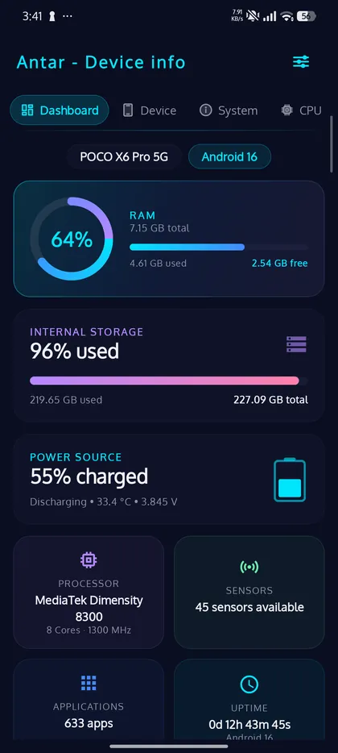<br/><sub><b>Dashboard</b></sub></td>
    <td align="center">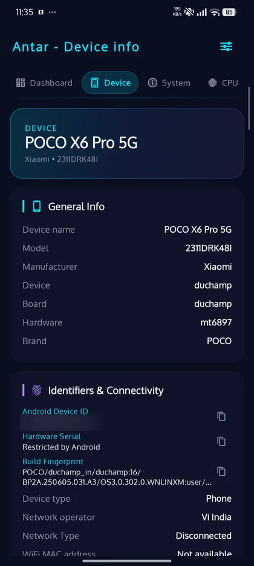<br/><sub><b>Device</b></sub></td>
    <td align="center">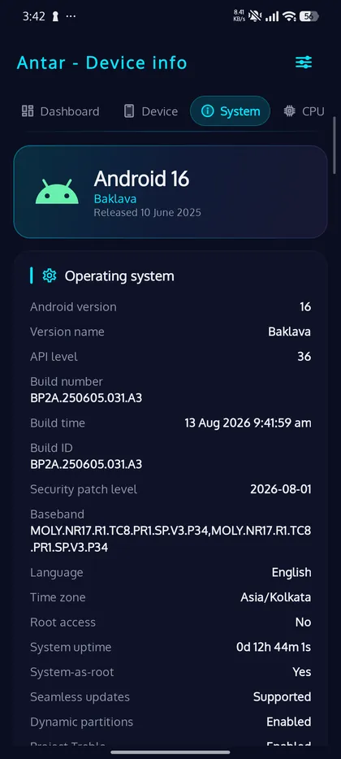<br/><sub><b>System</b></sub></td>
    <td align="center">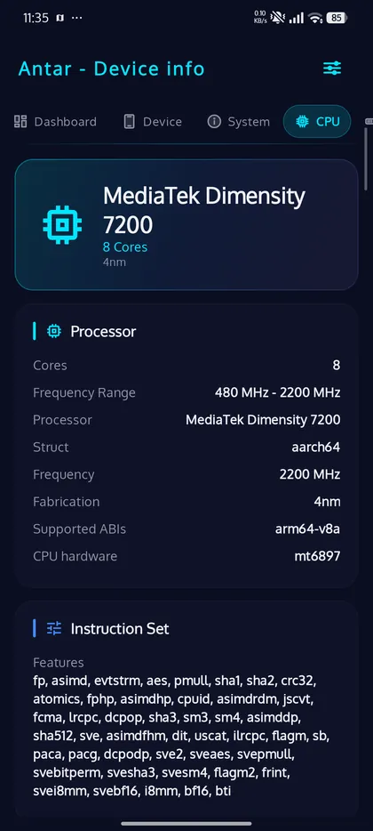<br/><sub><b>CPU</b></sub></td>
  </tr>
  <tr>
    <td align="center">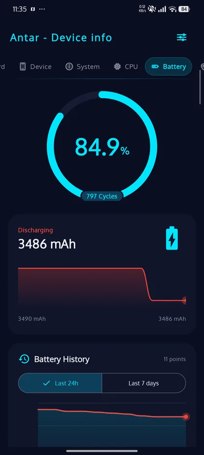<br/><sub><b>Battery</b></sub></td>
    <td align="center">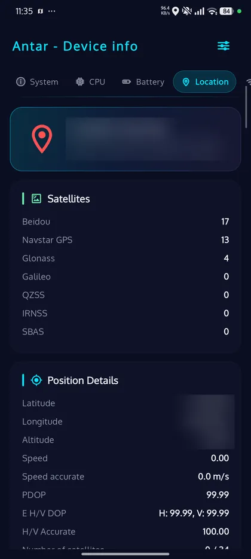<br/><sub><b>Location</b> (position blurred)</sub></td>
    <td align="center">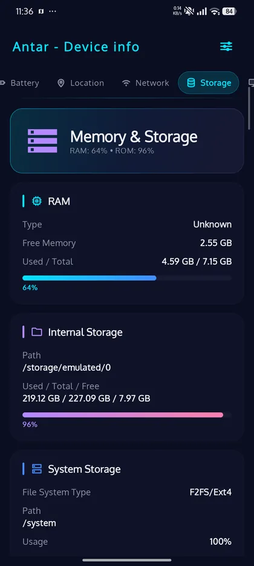<br/><sub><b>Storage</b></sub></td>
    <td align="center">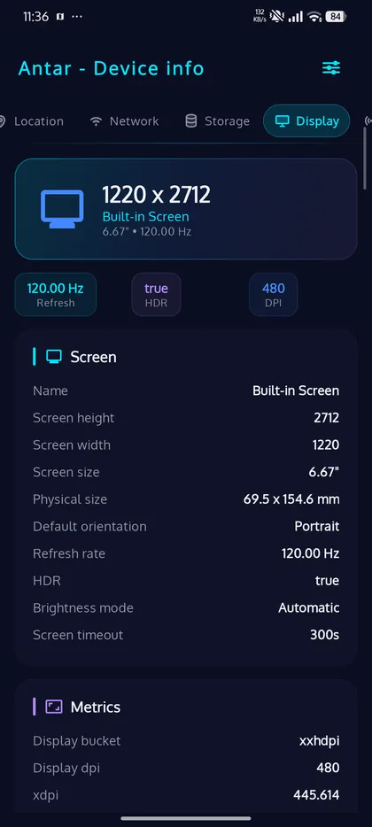<br/><sub><b>Display</b></sub></td>
  </tr>
  <tr>
    <td align="center">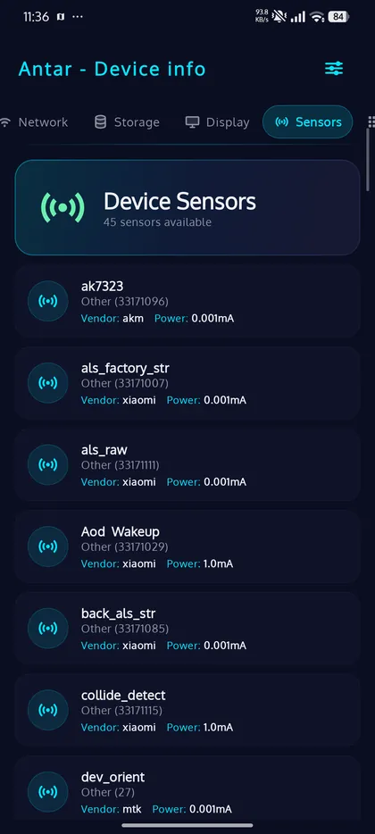<br/><sub><b>Sensors</b></sub></td>
    <td align="center">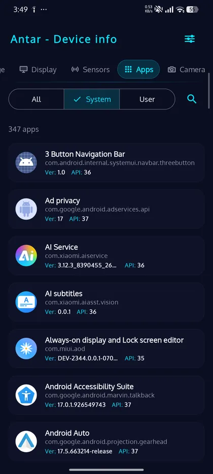<br/><sub><b>Apps</b></sub></td>
    <td align="center">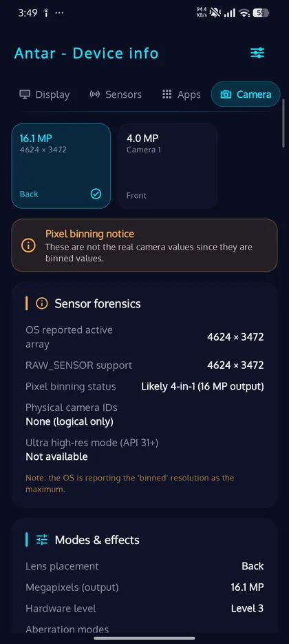<br/><sub><b>Camera</b></sub></td>
    <td></td>
  </tr>
</table>

Captured from v1.5.0 on a POCO X6 Pro 5G (Android 16).

## Permissions & privacy

| Permission | Why it is needed |
|---|---|
| `ACCESS_FINE_LOCATION`, `ACCESS_COARSE_LOCATION` | GPS coordinates, satellites and the address on the Location tab; the Wi-Fi network name and security type on the Network tab |
| `ACCESS_NETWORK_STATE`, `ACCESS_WIFI_STATE` | connection type, IP, DNS, gateway and Wi-Fi link details |
| `QUERY_ALL_PACKAGES` | the installed-apps list on the Apps tab |

Every permission is asked for from an in-app explanation first; after a permanent denial the button opens the
app's system settings instead. The Network tab shows its connection details without any permission; only the
Wi-Fi network identity needs location. Approximate location is enough for coordinates; satellites need precise.
The installed-apps list is read only after you accept a one-time disclosure on the Apps tab.

The app declares **no `INTERNET` permission**, so nothing it reads can be sent anywhere. What it stores, on the
device only:

- settings (Preferences DataStore)
- a battery log every 15 minutes, kept for 30 days (Room database `antar_db`)
- a cached copy of the installed-apps list in the no-backup folder, so it is never included in backups

Android Auto Backup is enabled (`allowBackup="true"`), so settings and the battery log are included in your
device's Google backup. Uninstalling the app deletes them from the phone.

## How it works

The code follows one layout: `core/` (error model, design system, shared UI), `domain/` (pure-Kotlin models,
repository interfaces, one use case per action), `data/` (repositories that read Android APIs on an injected IO
dispatcher and return `AppResult`), `presentation/<screen>/` (a ViewModel and a sealed `UiState` per screen) and
`di/` (Koin modules, checked by a unit test).

### Live battery readings that stop when you leave
`ACTION_BATTERY_CHANGED` only fires when the level or charger changes, but current and power move every second,
so the stream combines the broadcast with a 2-second poll:

<!-- src: app/src/main/java/com/ashes/dev/works/system/core/internals/antar/data/repository/BatteryRepositoryImpl.kt -->
```kotlin
override fun getBatteryInfo(): Flow<Battery> = callbackFlow {
    val batteryManager = context.getSystemService(Context.BATTERY_SERVICE) as BatteryManager
    // …
    val receiver = object : BroadcastReceiver() {
        // …
    }
    // …
    context.registerReceiver(receiver, IntentFilter(Intent.ACTION_BATTERY_CHANGED))

    // The receiver already pushes an update on every real battery change. We poll only to refresh
    // live current/power/temperature; 2s keeps it responsive while cutting per-tick work ~4x.
    val pollJob = launch {
        while (true) {
            pollBattery()
            delay(2000)
        }
    }

    awaitClose {
        context.unregisterReceiver(receiver)
        pollJob.cancel()
    }
}.distinctUntilChanged() // Only emit when the Battery data actually changes
    .flowOn(io) // PowerProfile reflection, sticky-intent and sysfs reads stay off main
```
Full code: [BatteryRepositoryImpl.kt, lines 43–84](app/src/main/java/com/ashes/dev/works/system/core/internals/antar/data/repository/BatteryRepositoryImpl.kt#L43-L84)

The ViewModels share it with `SharingStarted.WhileSubscribed(5000)`, so the receiver and the poll are torn down
5 seconds after the screen is no longer visible.

### Address lookup that never blocks the GPS callbacks
Location updates arrive every 2 seconds plus a GNSS status callback, and reverse geocoding can take seconds on
a slow network. Geocoding runs asynchronously and only after the position moves at least
`GEOCODE_MIN_DISTANCE_M = 25f` metres:

<!-- src: app/src/main/java/com/ashes/dev/works/system/core/internals/antar/data/repository/LocationRepositoryImpl.kt -->
```kotlin
fun geocodeIfMoved(location: AndroidLocation) {
    val last = lastGeocoded
    if (last != null && last.distanceTo(location) < GEOCODE_MIN_DISTANCE_M) return
    lastGeocoded = location
    if (Build.VERSION.SDK_INT >= Build.VERSION_CODES.TIRAMISU) {
        geocoder.getFromLocation(location.latitude, location.longitude, 1) { results ->
            address = results.firstOrNull()?.getAddressLine(0) ?: "- - -"
            tryEmitLocation()
        }
    } else {
        launch(io) {
            address = try {
                @Suppress("DEPRECATION")
                geocoder.getFromLocation(location.latitude, location.longitude, 1)
                    ?.firstOrNull()?.getAddressLine(0) ?: "- - -"
            } catch (e: Exception) {
                "- - -"
            }
            tryEmitLocation()
        }
    }
}
```
Full code: [LocationRepositoryImpl.kt, lines 96–117](app/src/main/java/com/ashes/dev/works/system/core/internals/antar/data/repository/LocationRepositoryImpl.kt#L96-L117)

### 30 days of battery history from a background worker
A WorkManager job, scheduled every 15 minutes in `AntarApp.kt` and created by Koin, asks the repository to log one
reading and trims anything older than 30 days:

<!-- src: app/src/main/java/com/ashes/dev/works/system/core/internals/antar/data/worker/BatteryLogWorker.kt -->
```kotlin
override suspend fun doWork(): Result {
    return try {
        // No battery state to read right now: try again later, within the same retry cap.
        if (!batteryRepository.logCurrentBattery()) return retryOrFail()

        // Purge logs older than 30 days
        val thirtyDaysAgo = System.currentTimeMillis() - TimeUnit.DAYS.toMillis(30)
        batteryRepository.deleteLogsOlderThan(thirtyDaysAgo)

        Result.success()
    } catch (e: CancellationException) {
        throw e // WorkManager stopped us — that's not a failure to retry
    } catch (e: Exception) {
        // A persistent error (disk full, corrupt DB) must not retry forever every period.
        if (runAttemptCount < MAX_RETRIES) Result.retry() else Result.failure()
    }
}
```
Full code: [BatteryLogWorker.kt, lines 16–32](app/src/main/java/com/ashes/dev/works/system/core/internals/antar/data/worker/BatteryLogWorker.kt#L16-L32)

The Battery tab reads it back as a Room `Flow` for the 24 h and 7 day charts and the charging-session list.

### A dashboard that waits for consent
The dashboard is assembled by a use case from the other features. Static facts are read once, battery and uptime
drive live updates, and the installed-app count is only read after the Apps disclosure is accepted:

<!-- src: app/src/main/java/com/ashes/dev/works/system/core/internals/antar/domain/usecase/ObserveDashboardUseCase.kt -->
```kotlin
operator fun invoke(): Flow<DashboardSummary> = flow {
    val device = getDeviceInfo().getOrNull()
    val system = getSystemInfo().getOrNull()
    val cpu = getCpuInfo().getOrNull()
    val sensorCount = getSensors().getOrNull()?.size

    val appCount = observeSettings()
        .map { it.appsConsentGiven }
        .distinctUntilChanged()
        .map { consented -> if (consented) getInstalledAppCount().getOrNull() else null }

    emitAll(
        combine(observeBattery(), observeUptime(), appCount) { battery, uptime, apps ->
            val storage = getStorageInfo().getOrNull()
            // …
        }.conflate()
    )
}
```
Full code: [ObserveDashboardUseCase.kt, lines 29–58](app/src/main/java/com/ashes/dev/works/system/core/internals/antar/domain/usecase/ObserveDashboardUseCase.kt#L29-L58)

Any part that cannot be read becomes `null`, and its card hides instead of showing an invented value.

## Build

```bash
./gradlew assembleDebug
./gradlew testDebugUnitTest
```

The debug APK lands in `app/build/outputs/apk/debug/`. The unit tests include a Koin check that every
dependency in the graph resolves.

Toolchain: JDK 25 · Gradle 9.6.0 (wrapper) · Android Gradle Plugin 9.4.0 · Kotlin 2.4.20 · compileSdk/targetSdk 37 ·
minSdk 24. No API keys or config files are needed.

Libraries: Jetpack Compose (BOM 2026.09.00) with Material 3 and Material 3 adaptive 1.3.0 · Navigation Compose
2.10.1 · Koin 4.2.2 · Room 2.8.5 (KSP 2.3.12) · DataStore 1.2.1 · WorkManager 2.11.2 · Kotlin Coroutines 1.11.0 ·
Accompanist Permissions 0.37.3 · Core SplashScreen 1.2.0 · ProfileInstaller 1.4.1.

Baseline Profile: `./gradlew :app:generateReleaseBaselineProfile` on a connected Android 13+ device records the
startup and tab-swipe journey; `:baselineprofile:connectedBenchmarkReleaseAndroidTest` measures cold start with
and without it.

Branches: work lands on `test`, moves to `dev`, then `prod`. Every push to `prod` builds `ANTAR.apk` and attaches
it to the GitHub Release tagged `v<versionName>`.

## Test results

Last full run: 17 September 2026, on the `test` branch, on a POCO X6 Pro 5G (MediaTek Dimensity 8300,
Android 16) over wireless debugging.

| Check | Result |
|---|---|
| Unit tests (`testDebugUnitTest`) | 13 of 13 pass, including the Koin graph, component-library boundary and presentation layout checks |
| Lint (`lintDebug`) | pass |
| Instrumented UI tests on the phone | 3 of 3 pass: app context, dashboard loads then System tab opens, shared UI components |
| Baseline Profile generation | pass: 27,602 rules each in `baseline-prof.txt` and `startup-prof.txt` |
| Cold start, no ahead-of-time compilation | median 558.5 ms (min 497.2, max 635.1) |
| Cold start, with the Baseline Profile | median 506.8 ms (min 452.3, max 561.4), about 9% faster |
| Manual pass on the phone | all 12 tabs, settings migration, Settings Apply, light and dark theme; no crashes |
| Hardcoded-string and motion audits | 0 hardcoded strings; every screen has motion |

Cold start is `timeToInitialDisplayMs` from Macrobenchmark, 10 runs each, release build. The Baseline
Profile ships in release builds; the `ANTAR.apk` on the Releases page is a debug build and does not use it.

Run the on-device tests yourself (connect one device and allow the install prompts):

```bash
./gradlew :app:connectedDebugAndroidTest
./gradlew :app:generateReleaseBaselineProfile
./gradlew :baselineprofile:connectedBenchmarkReleaseAndroidTest
```

## Structure

195 Kotlin files, 15,177 lines, in `app/src/main/java/com/ashes/dev/works/system/core/internals/antar/`:

| Package | Owns |
|---|---|
| `MainActivity.kt`, `AntarApp.kt` | the activity only hosts `AntarRoot` (system splash, edge-to-edge, bar colours); the application class starts Koin and schedules the battery logger |
| `core/common/` | `AppResult` / `AppError` error model, `UiText` |
| `core/designsystem/theme/` | theme, colours, typography, motion tokens and helpers |
| `domain/model/`, `domain/repository/`, `domain/usecase/` | typed models, repository interfaces, one use case per action |
| `data/repository/` | Android API readers (BatteryManager, LocationManager, ConnectivityManager, Camera2, PackageManager, `/proc`, sysfs) |
| `data/local/` | Room battery log, DataStore settings, installed-apps cache |
| `data/worker/`, `data/mapper/` | WorkManager battery logger, entity to domain mapping |
| `presentation/app/` | `AntarRoot`: theme, onboarding → splash → tabs, back button and exit dialog |
| `presentation/<screen>/` | one screen, its ViewModel and sealed `UiState`; `components/` holds the cards, rows and charts only that screen uses |
| `presentation/components/` | shared component library (rows, cards, chips, loading and error states, permission gate, adaptive grid): plain strings and theme colours, so it can be copied into another app |
| `presentation/common/` | ANTAR's string-resource versions of the shared components, error messages, size formatting |
| `presentation/navigation/`, `presentation/splash/` | navigation graph and routes, animated splash |
| `di/` | Koin modules: dispatchers, database, DataStore, repositories, use cases, ViewModels, workers |

The `:baselineprofile` module holds the profile generator and the startup benchmark. Tests: 13 unit tests
(including the Koin graph check, a component-library boundary check and a layout check that keeps screen
components in their screen's folder and UI out of the activity) and 3 instrumented Compose tests.

---

<h3 align="center">Matta Ashok Varma</h3>

<p align="center">
  <a href="https://github.com/ashokvarmamatta"></a>
  &nbsp;
  <a href="https://linkedin.com/in/ashokvarmamatta"></a>
  &nbsp;
  <a href="https://ashokvarmamatta.github.io/portfolio/"></a>
</p>
